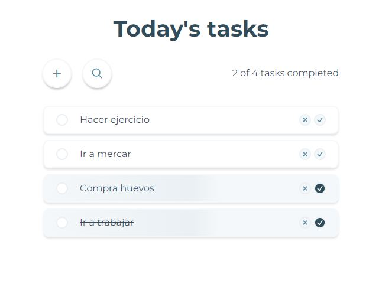

# ToDo-List App

La App de ToDoList se hizo para practicar mis habilidades, usé Styled-components en algunos lados para aprender de esta libreria, tambien usé CSS modules para igualmente practicar el tema de los modulos, y se mejoró la app gracias a un curso de React de [Platzi](https://platzi.com/cursos/react/) en el cual realizaban este proyecto, que me sirvió para agregar un input para buscar las tareas.
> 👷‍♂️ Sigue en desarrollo constante.
> 

## Live demo

> Proximamente
> 

## **Tecnologias/recursos**

- [React](https://react.dev/)
- [Heroicons](https://heroicons.com/) (icon library)
- [Styled-components](https://styled-components.com/)
- [Vitejs](https://vitejs.dev/) (con Css-modules)

## Caracteristicas

- [x]  Responsive layout (mobile/tablet/desktop)
- [x]  useContext
- [x]  Local Storage
- [x]  Estados de Loading, Error y vacio.
- [ ]  Eliminar tarreas en mobile arrastrando

## Imagen del proyecto

